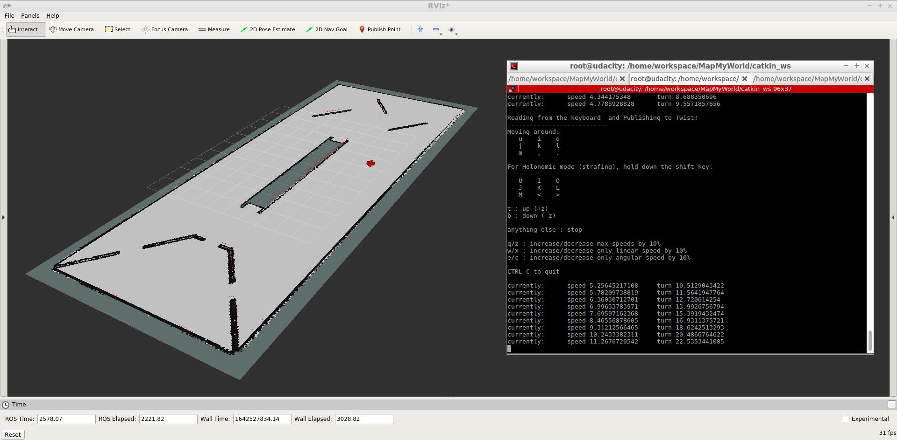
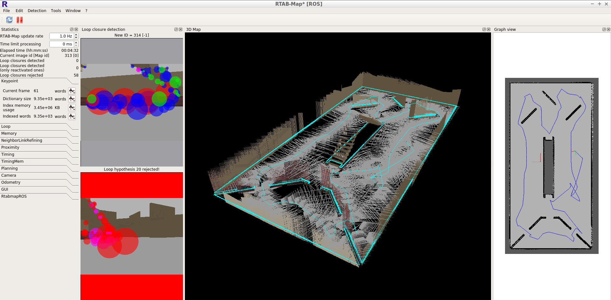
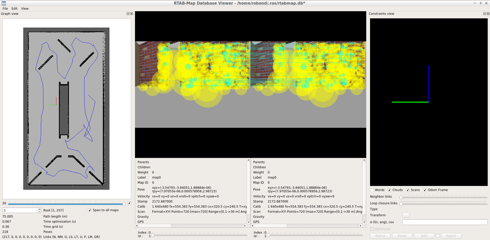

# RoboND - Project4: Map My World
Project 4 of Udacity Robotics Software Engineer Nanodegree Program


 
 

## Overview  
In this project you will create a 2D occupancy grid and 3D octomap from a simulated environment using your own robot with the RTAB-Map package.  
RTAB-Map (Real-Time Appearance-Based Mapping) is a popular solution for SLAM to develop robots that can map environments in 3D. RTAB-Map has good speed and memory management, and it provides custom developed tools for information analysis. Most importantly, the quality of the documentation on ROS Wiki (http://wiki.ros.org/rtabmap_ros) is very high. Being able to leverage RTAB-Map with your own robots will lead to a solid foundation for mapping and localization well beyond this Nanodegree program.  
For this project we will be using the `rtabmap_ros` package, which is a ROS wrapper (API) for interacting with RTAB-Map. Keep this in mind when looking at the relative documentation.  
* You will develop your own package to interface with the rtabmap_ros package.  
* You will build upon your localization project to make the necessary changes to interface the robot with RTAB-Map. An example of this is the addition of an RGB-D camera.  
* You will ensure that all files are in the appropriate places, all links are properly connected, naming is properly setup and topics are correctly mapped. Furthermore you will need to generate the appropriate launch files to launch the robot and map its surrounding environment.  
* When your robot is launched you will teleop around the room to generate a proper map of the environment.  

## Prerequisites/Dependencies  
* Gazebo >= 7.0  
* ROS Kinetic  
* ROS navigation package  
```
sudo apt-get install ros-kinetic-navigation
```
* ROS map_server package  
```
sudo apt-get install ros-kinetic-map-server
```
* ROS move_base package  
```
sudo apt-get install ros-kinetic-move-base
```
* ROS amcl package  
```
sudo apt-get install ros-kinetic-amcl
```
* ROS rtabmap-ros package
```
sudo apt-get install ros-kinetic-rtabmap-ros
```

## Setup Instructions
1. Meet the `Prerequisites/Dependencies`  
2. Open Ubuntu Bash and clone the project repository  
3. On the command line execute  
```bash
sudo apt-get update && sudo apt-get upgrade -y
```
4. Build and run your code.  

## Project Description  
Directory Structure  
```
.Map-My-World                                  
└── catkin_ws
    ├── build
    │   ├── atomic_configure
    │   ├── catkin
    │   │   └── catkin_generated
    │   │       └── version
    │   ├── catkin_generated
    │   │   ├── installspace
    │   │   └── stamps
    │   │       └── Project
    │   ├── CMakeFiles
    │   │   ├── 3.5.1
    │   │   │   ├── CompilerIdC
    │   │   │   └── CompilerIdCXX
    │   │   ├── clean_test_results.dir
    │   │   ├── CMakeTmp
    │   │   ├── download_extra_data.dir
    │   │   ├── doxygen.dir
    │   │   ├── run_tests.dir
    │   │   └── tests.dir
    │   ├── gtest
    │   │   ├── CMakeFiles
    │   │   │   ├── gmock.dir
    │   │   │   │   ├── src
    │   │   │   │   └── usr
    │   │   │   │       └── src
    │   │   │   │           └── gtest
    │   │   │   │               └── src
    │   │   │   └── gmock_main.dir
    │   │   │       ├── src
    │   │   │       └── usr
    │   │   │           └── src
    │   │   │               └── gtest
    │   │   │                   └── src
    │   │   └── gtest
    │   │       └── CMakeFiles
    │   │           ├── gtest.dir
    │   │           │   └── src
    │   │           └── gtest_main.dir
    │   │               └── src
    │   ├── my_robot
    │   │   ├── catkin_generated
    │   │   │   ├── installspace
    │   │   │   └── stamps
    │   │   │       └── my_robot
    │   │   └── CMakeFiles
    │   │       └── _catkin_empty_exported_target.dir
    │   ├── pgm_map_creator
    │   │   ├── catkin_generated
    │   │   │   ├── installspace
    │   │   │   └── stamps
    │   │   │       └── pgm_map_creator
    │   │   ├── CMakeFiles
    │   │   │   ├── collision_map_creator.dir
    │   │   │   │   └── src
    │   │   │   ├── request_publisher.dir
    │   │   │   │   └── src
    │   │   │   ├── roscpp_generate_messages_cpp.dir
    │   │   │   ├── roscpp_generate_messages_eus.dir
    │   │   │   ├── roscpp_generate_messages_lisp.dir
    │   │   │   ├── roscpp_generate_messages_nodejs.dir
    │   │   │   ├── roscpp_generate_messages_py.dir
    │   │   │   ├── rosgraph_msgs_generate_messages_cpp.dir
    │   │   │   ├── rosgraph_msgs_generate_messages_eus.dir
    │   │   │   ├── rosgraph_msgs_generate_messages_lisp.dir
    │   │   │   ├── rosgraph_msgs_generate_messages_nodejs.dir
    │   │   │   ├── rosgraph_msgs_generate_messages_py.dir
    │   │   │   ├── std_msgs_generate_messages_cpp.dir
    │   │   │   ├── std_msgs_generate_messages_eus.dir
    │   │   │   ├── std_msgs_generate_messages_lisp.dir
    │   │   │   ├── std_msgs_generate_messages_nodejs.dir
    │   │   │   └── std_msgs_generate_messages_py.dir
    │   │   └── msgs
    │   │       └── CMakeFiles
    │   │           └── collision_map_creator_msgs.dir
    │   ├── teleop_twist_keyboard
    │   │   ├── catkin_generated
    │   │   │   ├── installspace
    │   │   │   └── stamps
    │   │   │       └── teleop_twist_keyboard
    │   │   └── CMakeFiles
    │   └── test_results
    ├── devel
    │   ├── lib
    │   │   ├── pgm_map_creator
    │   │   └── pkgconfig
    │   └── share
    │       ├── my_robot
    │       │   └── cmake
    │       ├── pgm_map_creator
    │       │   └── cmake
    │       └── teleop_twist_keyboard
    │           └── cmake
    └── src
        ├── my_robot
        │   ├── config
        │   │   └── __MACOSX
        │   ├── launch
        │   ├── maps
        │   ├── meshes
        │   ├── urdf
        │   └── worlds
        │       └── worldchasesim
        ├── pgm_map_creator
        │   ├── launch
        │   ├── maps
        │   ├── msgs
        │   ├── src
        │   └── world
        └── teleop_twist_keyboard
```

## Run the project  
* Clone this repository
```
https://github.com/margrammas/MapMyWorld.git
```
* Open the repository and make  
```
cd /home/workspace/MapMyWorld/catkin_ws
catkin_make
source devel/setup.bash
```
* Launch my_robot in Gazebo to load both the world and plugins  
```
roslaunch my_robot world.launch
```  
* Launch teleop_twist_keyboard node, open a new terminal (Ctrl+Shift+T), enter  
```
cd /home/workspace/MapMyWorld/catkin_ws/
source devel/setup.bash
rosrun teleop_twist_keyboard teleop_twist_keyboard.py
```  
* Launch teleop_twist_keyboard node, open a new terminal, enter  
```
cd /home/workspace/MapMyWorld/catkin_ws/
source devel/setup.bash
roslaunch my_robot mapping.launch
```  
* Testing  
Send move command via teleop package to control your robot and observe real-time visualization in the environment `rtabmapviz`.  
rtabmap-databaseViewer ~/.ros/rtabmap.db

* View database
Once you statisfied with your move and the map is generated, press `Ctrl + C` to stop teleop, then view your database with
```
rtabmap-databaseViewer ~/.ros/rtabmap.db
```
Remember to move or copy your `~/.ros/rtabmap.db` before your next attempt since it will be deleted due to the launch file setting in `mapping.launch`.

Enjoy!

## Tips  
1. It's recommended to update and upgrade your environment before running the code.  
```bash
sudo apt-get update && sudo apt-get upgrade -y
```
